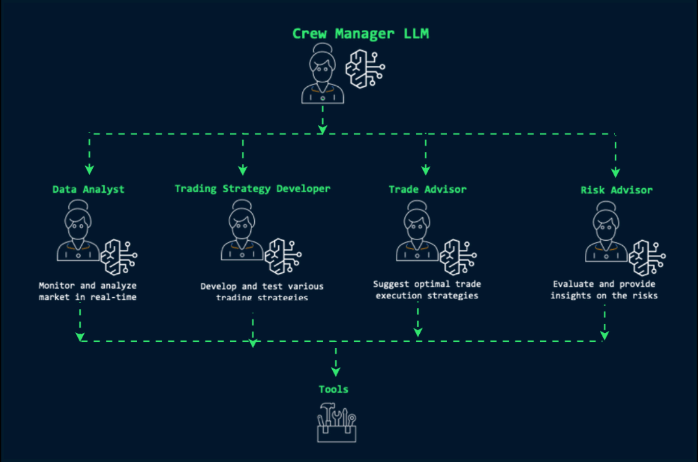

# 🌟 Multi-Agent Collaboration for Financial Analysis

Welcome to the **Multi-Agent Collaboration for Financial Analysis** repository! This project showcases how multiple intelligent agents can work together to solve complex financial tasks. 🚀



## 📋 Prerequisites

Before running the code, make sure you have the following set up:

### 🛠 Environment Setup

- Install the required libraries:
  ```bash
  pip install crewai crewai_tools anthropic litellm langchain_community
  ```

- Ensure Python 3.8+ is installed.

- Use either:
  - **Jupyter Notebook**: Install Jupyter Notebook and open the provided `.ipynb` file.
  - **VS Code (Jupyter Extension)**: Open the `.ipynb` file in [Visual Studio Code](https://code.visualstudio.com/) with the **Jupyter** extension for an integrated coding experience.  
  - **Google Colab**: Upload the `.ipynb` file to [Google Colab](https://colab.research.google.com/) for an easy-to-use cloud environment.
  - **Amazon SageMaker**: Use [Amazon SageMaker Studio](https://aws.amazon.com/sagemaker/studio/) for a managed and scalable machine learning environment.

### 🔑 API Keys

1. **Anthropic API Key**:
   - Visit [Anthropic's website](https://console.anthropic.com/) to create an account and generate an API key.
   - Rename `sample.env` to `.env`
   - Add the key to a `.env` file as `ANTHROPIC_API_KEY`.

2. **Serper API Key** (or other search APIs):
   - Sign up at [Serper](https://serper.dev/) to obtain an API key.
   - Add the key to the `.env` file as `SERPER_API_KEY`.

3. **Optional: Other LLMs**
   - While this repository uses Anthropic Claude, you can integrate other large language models (LLMs) by modifying the code accordingly. Ensure the appropriate API keys are added to the `.env` file.
  

## 📝 Solution Overview

This project focuses on:

1. **🤝 Multi-Agent Collaboration**: Leverages multiple agents to collaborate and exchange data for enhanced financial analysis.

2. **🧠 Anthropic Claude Integration**: Utilizes Claude for natural language processing and reasoning tasks.

3. **🔄 Extensibility**: Supports integration with other LLMs or APIs for customized workflows.

4. **🧰 Utilities**: The `utils` module includes helper functions for loading API keys and managing environment variables.

## 🤖 Agents in Action

Here are the 4 agents designed to collaborate in this project:

1. **📊 Data Analyst**: Gathers and processes financial data to extract meaningful insights.

2. **📈 Trading Strategy Agent**: Develops and evaluates trading strategies based on data trends and predictive models.

3. **💼 Trade Advisory Agent**: Provides recommendations on trade executions, taking into account market conditions and strategies.

4. **⚠️ Risk Advisor Agent**: Assesses potential risks and ensures strategies align with risk management protocols.

## 🚀 Running the Solution

1. Clone the repository:
   ```bash
   git clone https://github.com/viktoriasemaan/multi-agent.git
   cd financial-analysis
   ```

2. Rename `sample.env` to  `.env` file in the project directory:
   ```env
   ANTHROPIC_API_KEY=your_anthropic_key
   SERPER_API_KEY=your_serper_key
   ```

3. Run the Jupyter Notebook:
   ```bash
   jupyter notebook Collaboration_Financial_Analysis_wClaude.ipynb
   ```

4. Follow the notebook steps to execute the multi-agent collaboration workflow.

## ✨ Key Features

- **Flexibility**: Swap out Anthropic Claude for other LLMs like Llama or DeepSeek.
- **Scalable Workflows**: Easily extend the solution to handle different domains beyond financial analysis.
- **Modular Utilities**: Customize the `utils` module for additional functionality.

## 📜 License

This project is licensed under the MIT License.

## 🤗 Contributing

Contributions are welcome! Feel free to open issues or submit pull requests to improve the solution.


